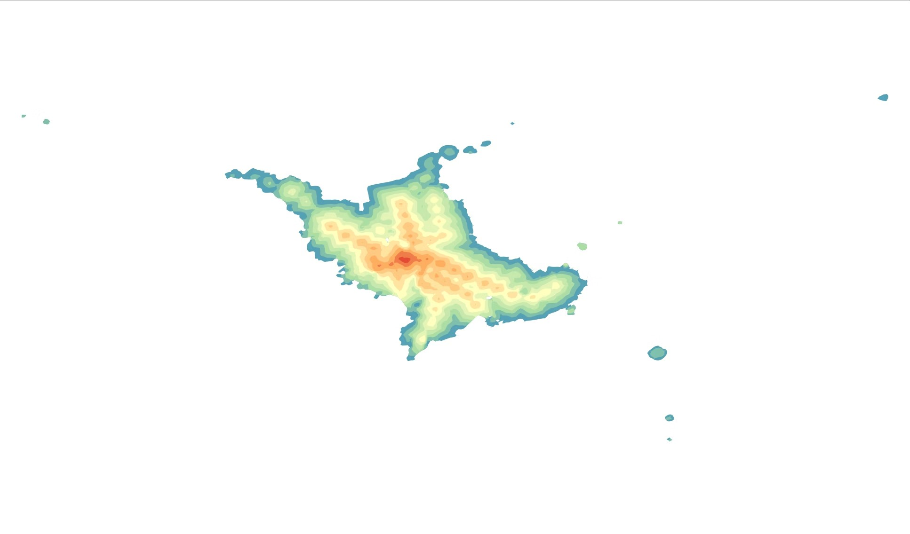

# QGIS OpenTripPlanner Multi Isochrone Plugin

This Plugin is designed to display Isochrone created by OpenTripPlanner in QGIS.
The strength of this plugin is that it can continuously calculate and display Isochrone at multiple times and even calculate statistical values.

QGISでOpenTripPlannerで作成した到達圏(Isochrone)を表示するためのプラグインです。
このプラグインの強みは、複数の時刻の到達圏を連続して算出・表示して、統計値まで算出できることです。

## How To Use 使い方

After activating OpenTripPlanner, fill in the specified items on this plug-in and it will automatically display the reachable area.

OpenTripPlannerを作動させた上で、本プラグイン上で指定項目を埋めて実行すると、自動的に到達圏が表示されます。

[プラグインの使い方記事(Qiita/日本語)](https://qiita.com/geogra/items/2e7e0e988bdbc5158414)
[プラグインを活用した実践記事(Qiita/日本語)](https://qiita.com/geogra/items/dbec185059e2882008df)

## Remarks 備考

This plugin was developed in conjunction with the presentation “[Development of a QGIS Plugin for Analyzing and Displaying Isochrones Using GTFS Data](https://pub.confit.atlas.jp/ja/event/gisa2024/presentation/E5-02)” at "The 33rd Annual Meeting of the Geographic Information Systems Conference" held in 2024. 
We would appreciate it if you could cite the above presentation when utilizing it in your papers.

このプラグインは、2024年実施の「第33回地理情報システム学会学術研究発表大会」にて発表を行なった「[GTFSデータを使用した到達圏を解析・表示するQGISプラグインの開発](https://pub.confit.atlas.jp/ja/event/gisa2024/presentation/E5-02)」 に合わせて作成したものです。
論文等で活用される場合は、上記の発表を引用していただきますと幸いです。

## お問い合わせ
山本 将大
Yamamoto Shota
info[a]mapmap.tokyo